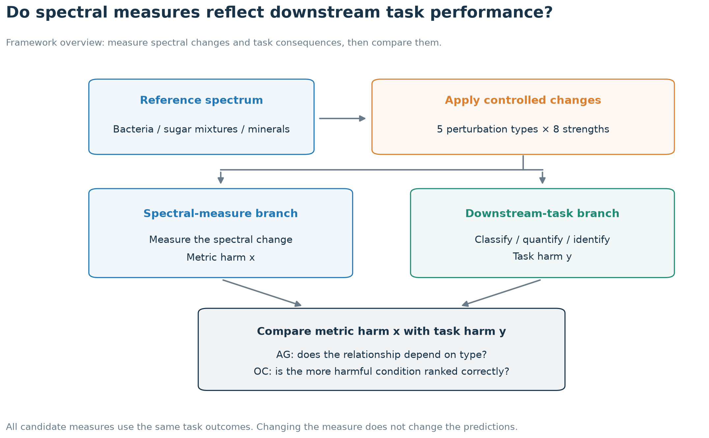
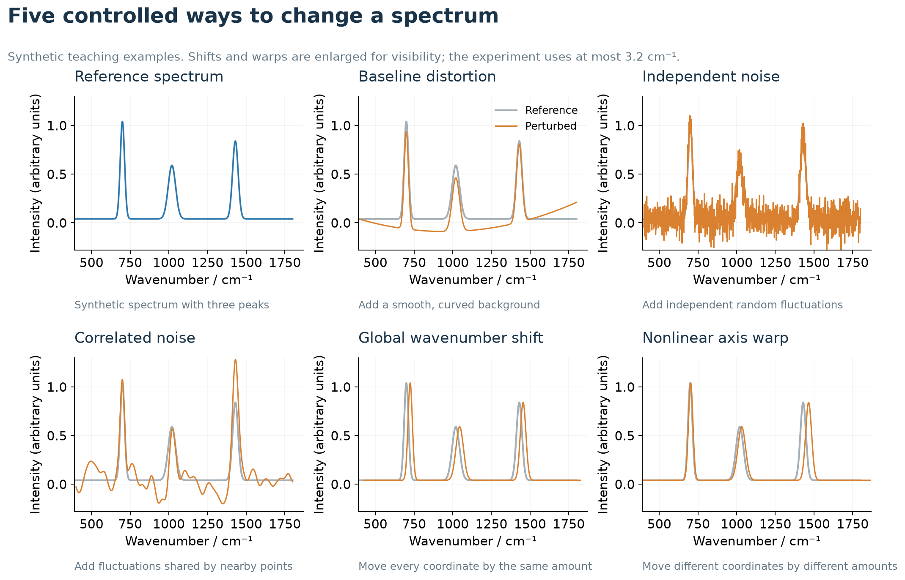
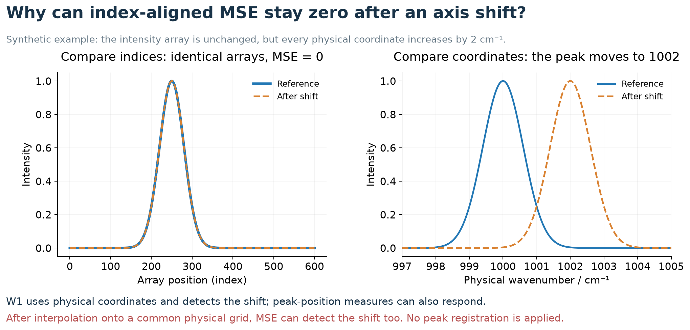
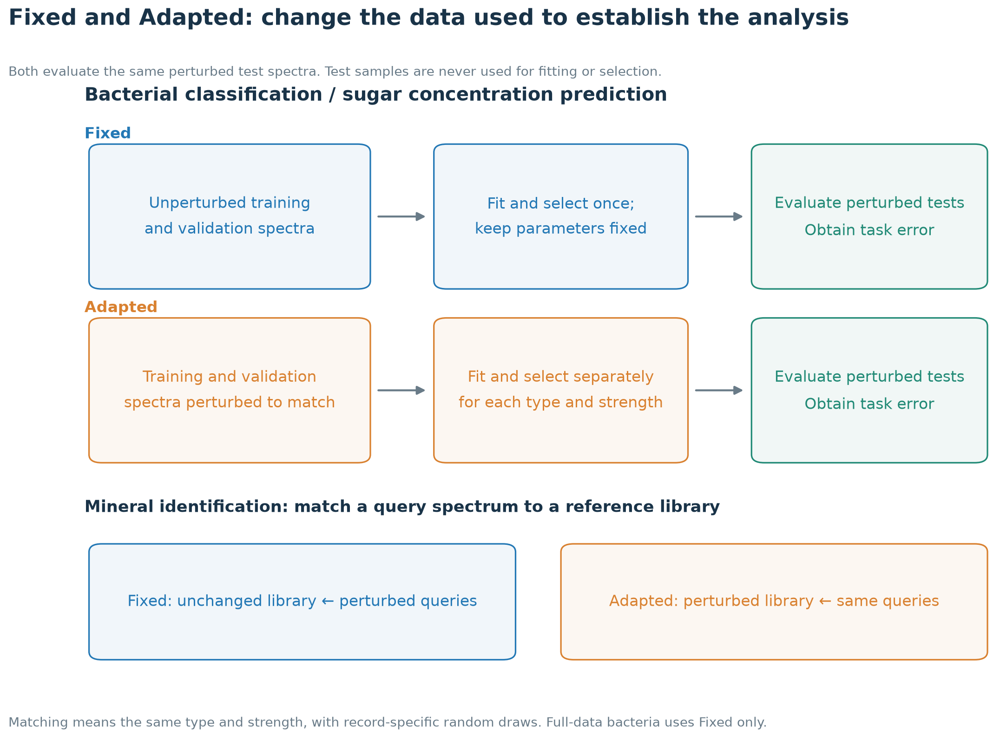
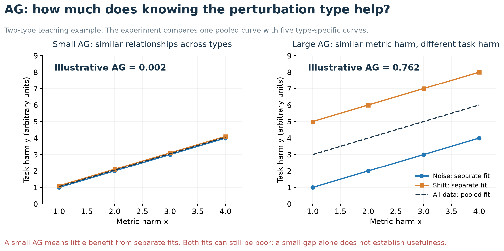
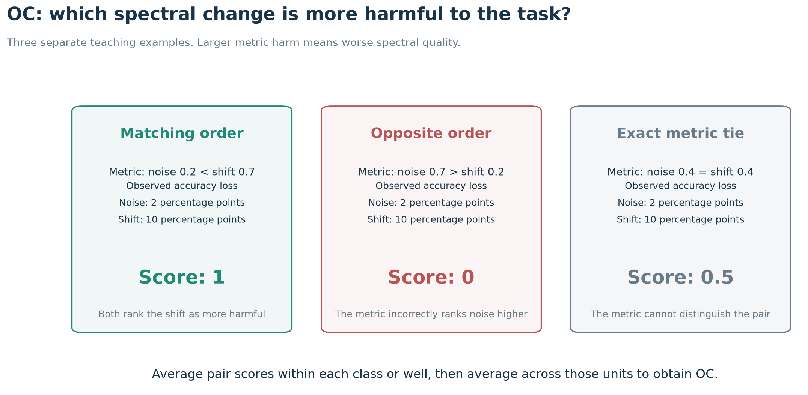
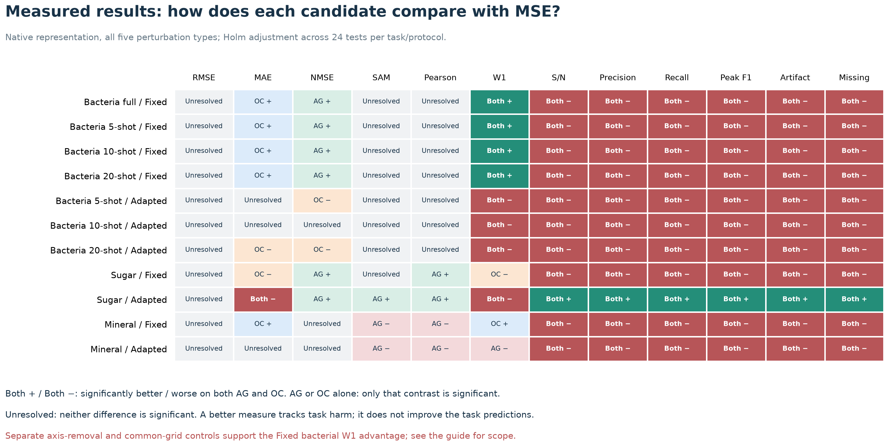

# What does this Raman study actually do?

**An illustrated guide to the methods and results**

This guide explains the evaluation framework and the results accompanying *A Task-Based Framework for Evaluating Raman Spectral Quality Measures*. It includes the completed axis-removal and common-grid controls. Updated: September 23, 2026.

The question is simple: **when a measure says that a Raman spectrum has become worse, does that change also mean that bacteria are harder to classify, sugar concentrations are harder to predict, or minerals are harder to identify?**

We apply controlled changes to spectra, measure both spectral changes and task performance, and compare them using **alignment gap (AG)** and **ordering concordance (OC)**. Different measures work well under different conditions. No measure improves on MSE across all the evaluated tasks and protocols.

The workflow, perturbation, coordinate, AG, and OC diagrams are teaching illustrations. The result matrix and the numerical results below come from the stored experimental summaries.

## 1. Why ask this question?

A Raman spectrum records signal intensity at different wavenumbers. Its peak positions, intensities, and shapes carry information about a sample's composition and structure.

Researchers often need to compare spectra: did denoising preserve useful information? Did background correction damage a peak? Does a calculated spectrum agree with a measured one? Measures such as MSE, correlation, and peak retention turn these comparisons into numbers.

But **a small spectral difference need not imply a small effect on the intended analysis**. Consider two hypothetical cases:

- A weak, narrow peak disappears. The overall MSE may be small, yet classification may suffer if that peak distinguishes two bacterial classes.
- A broad background changes substantially. MSE may be large, yet accuracy may change little if the classifier tolerates that background.

These examples motivate a test rather than a predetermined answer: do the differences emphasized by a measure matter to the task?

**Figure 1. Framework overview.** Every candidate measure is compared with the same task outcomes. Switching the evaluation measure does not change the classifier, calibration, or mineral-matching predictions.

## 2. What do the three datasets let us test?

A **downstream task** is the analysis we want to perform after obtaining a spectrum.

| Data source | Practical question | Analysis used here | Task harm |
|---|---|---|---|
| Bacteria-ID | Which bacterial class does this spectrum belong to? | PCA followed by logistic regression | Decrease in classification accuracy |
| Sugar mixtures | What are the concentrations of four sugars? | Partial least squares (PLS) regression | Increase in concentration-prediction error |
| RRUFF minerals | Which mineral produced this query spectrum? | Cosine-similarity matching to known reference spectra | Decrease in identification accuracy |

### Bacteria: predict a class

The study uses 30 bacterial isolate classes and 3,000 test spectra. The full-data setting has 62,700 training spectra and 300 validation spectra. Separate settings use only 5, 10, or 20 training spectra per class.

Thus **10-shot means ten training spectra per class**, or 300 in total. It does not mean ten test runs or a different classification algorithm.

PCA reduces each spectrum to 20 features describing its major variations. Logistic regression uses these features to distinguish classes. Validation data select the fitting settings; test data evaluate performance. Few-shot results are averaged across five fitting seeds. Those seeds are repetitions of the procedure, not independent biological samples.

### Sugar mixtures: predict concentrations

The dataset contains 240 physical wells, each measured 32 times, giving 7,680 low-SNR acquisitions. The targets are concentrations of sucrose, fructose, maltose, and glucose.

PLS establishes a calibration relationship between spectra and known concentrations, then predicts concentrations for new samples. Five-fold evaluation uses 144 training, 48 validation, and 48 test wells in each fold. All acquisitions from a well stay together, preventing repeated measurements of the same sample from appearing in both training and testing within a fold.

The concentration labels are nominal preparation values. Squared prediction errors are averaged over the sugars and acquisitions, then divided by `(0.32 mol/L)²`. This normalized loss is not itself a concentration difference in mol/L.

### Minerals: find a match in a library

The cohort contains 3,770 spectra from 681 mineral classes. Five fixed library/query splits keep related records apart according to the grouping rules.

Spectra are placed on a common wavenumber grid and intensity-normalized. Each query receives the mineral label of the reference spectrum with the highest cosine similarity.

This task uses a library rather than fitting a classifier. **The thirteen quality measures assess spectral changes; they are not substituted one by one for the cosine matching rule.**

These three analysis procedures are specified by this study, rather than being the only methods that can be used with the datasets. RamanBench supported source discovery and loading checks; the cohorts, splits, and downstream experiments use this study's definitions.

## 3. How are spectra changed?

We apply five controlled perturbation types. Every measure sees the same perturbed spectra.

**Figure 2. Teaching examples, not measured spectra.** Gray curves are the reference; orange curves are perturbed. Shifts and warps are enlarged to make their effects visible and do not depict the strengths used in the experiment.

| Perturbation | Plain-language description | What changes? |
|---|---|---|
| Baseline distortion | Add a smooth, slowly varying background | Intensity |
| Independent noise | Add separate random fluctuations at individual sampling points | Intensity |
| Correlated noise | Add fluctuations that vary together across nearby points | Intensity |
| Global wavenumber shift | Move all coordinates by the same distance | Wavenumber coordinates |
| Nonlinear axis warp | Move different coordinates by different distances | Wavenumber coordinates |

The intensity perturbations are scaled relative to each reference spectrum's root mean square (RMS) intensity. Baseline distortion uses a low-order polynomial; independent noise uses Gaussian draws; correlated noise uses a Gaussian smoothing kernel with a 20 cm⁻¹ scale.

The baseline and correlated-noise shapes have unit RMS before scaling. Independent noise has the same added **squared energy in expectation**, but each finite noise realization is not normalized to exactly the same energy.

Each type has eight strengths:

`0.05, 0.10, 0.20, 0.30, 0.40, 0.50, 0.65, 0.80`.

This parameter, **alpha**, controls the size of a change. It is not an error rate, and equal alpha does not imply equal physical or task effects across perturbation types.

The global shift is `4 × alpha cm⁻¹`: alpha = 0.20 gives a shift of 0.8 cm⁻¹, and the largest shift is 3.2 cm⁻¹. The warp has zero displacement at the low-wavenumber end and reaches the same maximum displacement at the high-wavenumber end.

Each task/protocol therefore has **5 × 8 = 40 perturbed conditions**, plus an unperturbed reference. A *condition* means one type and one strength, such as independent noise at alpha = 0.20. The reference defines the changes; it is not a forty-first condition in AG or OC.

“Unperturbed” means before adding these changes. It does not mean perfectly noise-free: the source spectra can already contain noise and source-specific preprocessing.

### Why does the wavenumber grid matter?

A spectrum contains both coordinates and intensities. If only its coordinates move, the stored intensity array can remain identical.

**Figure 3. A synthetic coordinate example.** The intensity at “array position 100” and the intensity at “1000 cm⁻¹” are different comparison rules.

In the **native representation**, index-aligned MSE compares the intensity arrays and is zero for the coordinate-only shift and warp. W1 reads physical coordinates and detects their displacement; peak-position measures can also respond.

In the **common-grid representation**, both spectra are interpolated onto the same physical grid before their measures are calculated. MSE can then detect the shift too. This interpolation preserves the displacement; it does not register peaks to remove it. The downstream analysis always uses the task grid. The completed controls described in Section 10 compare these choices directly.

## 4. What do Fixed and Adapted mean?

For classification and quantification, samples with known answers establish an analysis rule. **Fitting** here means estimating PCA/logistic-regression parameters or a PLS concentration calibration.

The comparison concerns **which spectra establish that rule: unperturbed spectra or spectra with the corresponding perturbation**.

**Figure 4. Two analysis protocols.** Sample identities and training, validation, and test roles stay the same.

### Fixed: establish the analysis using unperturbed data

Fit the classification rule or concentration calibration on unperturbed training spectra and select settings using unperturbed validation spectra. Hold the selected parameters fixed while evaluating perturbed test spectra.

For minerals, leave the reference library unchanged and perturb only the queries.

The practical question is: **which measures reflect how an existing analysis is affected when its input spectra change?**

### Adapted: establish a separate analysis for each perturbed condition

Apply the same perturbation type and strength to training and validation spectra as to the test spectra. Fit and select a separate classification rule or calibration for each condition. For bacteria, both PCA and logistic regression are fitted to that condition.

For example, independent noise at alpha = 0.20 and baseline distortion at alpha = 0.20 each receive their own fit. Test samples never participate in fitting or selection.

For minerals, perturb the reference library to match the query condition. Matching type and strength does not give every record identical random noise.

The question becomes: **when the data used to establish the analysis also have this change, which spectral differences still track task harm?** Adapted does not guarantee better performance.

Full-data bacteria uses Fixed only. The three few-shot bacterial settings, sugar, and minerals each use both protocols, giving **eleven task/protocol combinations**.

## 5. What do the thirteen measures look at?

Think of the measures as different rulers, each emphasizing particular information.

| Group | Measure | What does it ask? |
|---|---|---|
| Pointwise intensity | MSE | How large is the mean squared intensity difference? Large errors receive more weight. |
| Pointwise intensity | RMSE | What is the square root of MSE? |
| Pointwise intensity | MAE | How large is the mean absolute intensity difference? |
| Pointwise intensity | NMSE | How large is squared error relative to the reference's total squared intensity? |
| Global shape | Spectral angle (SAM) | How different are the directions of the two spectral vectors? |
| Global shape | Pearson correlation | Do the intensity variations rise and fall together? |
| Physical-axis distribution | Wasserstein distance (W1) | How far must normalized positive intensity move along the wavenumber axis to transform one distribution into the other? |
| Peak and structure | Structure-to-noise ratio (S/N) | How large is spectral variation relative to the estimated noise? |
| Peak and structure | Peak precision | What fraction of detected candidate peaks match reference peaks? |
| Peak and structure | Peak recall | What fraction of detected reference peaks remain matched? |
| Peak and structure | Peak F1 | How well are precision and recall jointly maintained? |
| Peak and structure | Artifact ratio | What fraction of detected candidate peaks have no reference match? |
| Peak and structure | Missing ratio | What fraction of detected reference peaks have no candidate match? |

W1 can be understood as moving piles of sand along the horizontal axis. The study normalizes positive spectral mass to one, so W1 describes where that mass lies rather than its total amount.

Peak measures use a fixed detector and match peaks within 2 cm⁻¹. They measure **stability of detected peaks**, rather than verified chemical assignments. S/N estimates structure and noise from an individual spectrum without needing a reference comparison.

The thirteen outputs are related. RMSE derives from MSE; artifact and missing ratios complement precision and recall when the denominators are positive; F1 combines precision and recall. Five peak measures agreeing is not five independent discoveries.

## 6. How are spectral changes paired with task changes?

First orient every measure so that larger values mean worse spectral quality. Call the resulting change **metric harm, x**:

- For lower-is-better measures such as MSE: perturbed value minus reference value.
- For higher-is-better measures such as correlation or peak F1: reference value minus perturbed value.

Define **task harm, y** in the same direction:

- Bacteria and minerals: reference accuracy minus perturbed accuracy.
- Sugar: perturbed concentration loss minus reference concentration loss.

If accuracy changes from 90% to 80%, y = 0.10: a loss of ten percentage points. If it changes to 92%, y = −0.02. Negative values are retained because a perturbation can accompany improved performance.

Measures are computed per spectrum and then aggregated within the statistical unit: bacterial class, physical well, or mineral class. Each observation pairs **one unit, one perturbation type, and one strength** with its `(x, y)` values. Fitting-seed and split repetitions are aggregated before inference.

AG and OC are calculated separately for each task/protocol. Losses from different tasks are not pooled into one analysis.

## 7. AG: does the measure need a different interpretation for each perturbation?

Suppose metric harm is 0.3 in two cases. Under noise, accuracy drops slightly; under a shift, it drops substantially. Knowing the metric value alone is then less informative than also knowing the perturbation type.

**AG measures how much the fit to observed task harm improves when the perturbation type is taken into account.**

**Figure 5. Synthetic AG examples.** Colored curves are type-specific fits; the dark dashed curve is the pooled fit. The displayed AG values are illustrative, not experimental task results.

The calculation has three steps:

1. Fit one nondecreasing curve from metric harm to task harm using all observations.
2. Fit a separate nondecreasing curve for each perturbation type.
3. Divide the reduction in squared fitting error by the total variation in task harm.

$$
\mathrm{AG}=\frac{\mathrm{SSE}_{\mathrm{pooled}}-\mathrm{SSE}_{\mathrm{separate}}}
{\sum_j(y_j-\bar y)^2}.
$$

SSE means the sum of squared differences between observations and their fitted values. A nondecreasing curve can stay level or rise: greater metric harm cannot be fitted as systematically lower task harm. This is **isotonic regression**.

These curves analyze the completed task experiment. They are separate from the classifier or concentration calibration used to produce task outcomes.

- **Large AG:** allowing different interpretations for different perturbations improves the fit substantially.
- **Small AG:** separate interpretations add little to the fit.

**Small AG alone does not establish a useful measure.** Both the pooled and separate fits can be poor while their difference is small. AG = 0.10 means that separate fits reduce residual error by an amount equal to 10% of the observed variation in task harm. It is not a 10% classification error rate or a measure of predictive accuracy on new samples. AG is undefined if task harm has no variation.

## 8. OC: can the measure identify the more harmful condition?

For the same class or well, compare two conditions from different perturbation types. **Does the condition ranked as worse by the measure also have greater task harm?**

**Figure 6. Teaching examples.** The comparison checks order; it does not require metric values to predict the size of the accuracy loss.

| Comparison | Pair score |
|---|---:|
| Both rank the same condition as more harmful | 1 |
| Their nonzero orderings disagree | 0 |
| Either metric harm or task harm is exactly tied, including a tie in both | 0.5 |

Average the pair scores within each statistical unit, then average across units to obtain OC. **OC is not classification or mineral-identification accuracy.** An OC of 0.80 is an average pair score of 0.80; because ties receive half credit, it does not necessarily mean that exactly 80% of pairs have strictly correct ordering.

Five types provide ten different type pairs. Each pair contributes every combination of their eight strengths:

`10 type pairs × 8 × 8 = 640 condition pairs per statistical unit`.

We do not compare different bacterial classes or wells, and we do not pair a Fixed condition with an Adapted condition. A measure that never changes ties every pair and has OC = 0.5.

### Why use AG and OC together?

| Summary | Main question | What it does not establish alone |
|---|---|---|
| AG, smaller preferred | How much does the metric-to-task relationship depend on perturbation type? | A small gap can occur when both fits are poor. |
| OC, larger preferred | Is the ordering of task harm correct? | Correct ordering does not imply accurate prediction of harm magnitude. |

The framework combines these complementary questions. Comparing monotone relationships and measuring pairwise agreement have statistical precedents; the study specifies how to apply them to controlled spectral perturbations and task-level observations.

## 9. When is a candidate better than MSE?

Each candidate is compared with MSE using:

$$
\Delta\mathrm{AG}=\mathrm{AG}_{\mathrm{MSE}}-\mathrm{AG}_{\mathrm{candidate}},
\qquad
\Delta\mathrm{OC}=\mathrm{OC}_{\mathrm{candidate}}-\mathrm{OC}_{\mathrm{MSE}}.
$$

Positive differences favor the candidate. Uncertainty matters as well as direction.

We use **2,000 paired cluster-bootstrap draws** to estimate 95% intervals. A sampled class or well keeps all its conditions and measures together. AG curves are refitted in each draw.

We also use **100,000 sign flips of paired statistical contributions** to test contrasts. This compares the observed contrast with a distribution produced by randomly reversing the signs of the units' contributions. For AG, the observed fitted curves remain fixed during this test. The procedure relies on symmetry and exchangeability assumptions; it is not an independent-spectrum test.

In the native five-type analysis, each task/protocol has twelve candidates and two summaries, giving a **24-test Holm adjustment**. The post hoc robustness analyses use their own declared test families, including 66 W1–MSE tests across the three controls and eleven settings.

“Better on both” requires positive contrasts and adjusted p-values below 0.05 for both summaries. Improvement in only one is reported separately. An unresolved difference does not establish equivalence. The bootstrap intervals are pointwise, while the tests include multiple-comparison adjustment.

## 10. What did the experiments find?

The native five-type analysis contains **11 task/protocol combinations × 13 outputs = 143 rows**. The matrix below shows the twelve candidates relative to MSE: 132 comparisons, each assessed by both AG and OC.

**Figure 7. Measured results in the native representation with all five perturbation types.** “Both +” means significantly smaller AG and higher OC; “Both −” means significantly worse on both. “AG +” or “OC +” marks a significant improvement only in that summary. “Unresolved” is not equivalence. The common-grid and axis-removal controls are separate analyses described below.

### 10.1 Bacteria: W1 improves both summaries for Fixed classifiers

For the 10-shot setting:

| Protocol | Measure | AG ↓ | OC ↑ |
|---|---|---:|---:|
| Fixed | MSE | 0.1600 | 0.7834 |
| Fixed | W1 | **0.0463** | **0.8327** |
| Adapted | MSE | **0.2866** | **0.7898** |
| Adapted | W1 | 0.3481 | 0.7250 |

Under Fixed, W1 reduces AG by 0.1137 (95% interval 0.0850–0.1391) and increases OC by 0.0493 (0.0273–0.0709). Both adjusted tests pass. The full-data, 5-shot, and 20-shot Fixed settings also favor W1 on both summaries.

Under Adapted, the native 10-shot contrasts become −0.0615 for AG and −0.0648 for OC, both significantly adverse. The 5- and 20-shot Adapted settings show the same direction.

**W1 did not change classification accuracy.** The predictions are shared across measures. The comparison asks which measure better reflects the changes in those predictions' performance.

Other measures offer partial gains. In Fixed bacteria, MAE improves OC and NMSE improves AG, without significant improvement in the other summary. At ten shots, the respective gains are about 0.0120 and 0.0234.

### 10.2 Sugar: peak stability is useful specifically under Adapted calibration

When the PLS calibration is fitted separately to each perturbed condition:

| Measure | AG ↓ | OC ↑ |
|---|---:|---:|
| MSE | 0.2759 | 0.6320 |
| Peak F1 | **0.1656** | **0.7031** |
| S/N | 0.2143 | 0.6609 |

Peak F1 improves AG by 0.1102 (95% interval 0.0702–0.1494) and OC by 0.0711 (0.0668–0.0752). Both adjusted p-values are below 0.001. The other four peak outputs and S/N also improve both summaries.

In this setting, **preservation of detected peaks better reflects concentration-prediction harm than pointwise squared error does**. This observation does not establish that missing peaks cause all prediction errors.

The scope is narrow: all five peak outputs and S/N are significantly worse on both summaries in the other ten native task/protocol combinations. No candidate improves both summaries in Fixed sugar. Pearson and NMSE improve AG alone there; W1 and MAE are worse on both under Adapted sugar.

### 10.3 Minerals: small ordering gains, but no improvement on both summaries

With the reference library Fixed:

| Measure | AG ↓ | OC ↑ |
|---|---:|---:|
| MSE | 0.02589 | 0.56372 |
| W1 | 0.02077 | 0.56978 |
| MAE | 0.02593 | 0.56489 |

W1 increases OC by about 0.00606, or 0.61 percentage points of average pair score. MAE increases it by about 0.00117. Both ordering gains pass the adjusted tests.

W1's AG is numerically smaller, but its adjusted p-value is 0.150, so it does not improve both summaries. Under the Adapted library, W1 has significantly worse AG and an unresolved OC difference. No candidate improves both summaries under either native library protocol.

This limits the evidence for replacing MSE in the evaluated cosine-matching procedure. It does not establish that MSE is optimal in every mineral task.

### 10.4 Does Adapted improve actual task performance?

Not uniformly. Averaged over the eight strengths in 10-shot bacteria, Adapted relative to Fixed:

- reduces baseline-related accuracy loss by about **24.84 percentage points**;
- increases independent-noise accuracy loss by about **9.97 percentage points**;
- increases correlated-noise accuracy loss by about **5.37 percentage points**.

These are changes in task harm, not OC, and not accuracies at a single strength. Establishing an analysis on perturbed data changes its response to different perturbations. This helps explain why a measure's agreement with task harm can change, without identifying a single cause for the entire result matrix.

### 10.5 What do the completed robustness controls show?

Three controls test the native W1 comparison: remove shift and warp; compute all measures on the common physical grid; or do both. Downstream predictions stay fixed. These are post hoc controls, with separately declared multiple-testing families.

**All four Fixed bacterial endpoints still favor W1 on both summaries under all three controls.** The resulting 24 tests pass the 66-test W1 adjustment. At ten shots:

| Comparison | ΔAG | ΔOC |
|---|---:|---:|
| Native, all five types | +0.1137 | +0.0493 |
| Native, baseline and noise types only | +0.1703 | +0.1168 |
| Common grid, all five types | +0.1651 | +0.0823 |
| Common grid, baseline and noise types only | +0.1725 | +0.1455 |

The fixed-classifier advantage therefore cannot be explained entirely by native MSE being insensitive to coordinate-only perturbations. In the native 10-shot Fixed result, the two axis types contribute only about 0.65% of MSE's AG, and comparisons involving only baseline and noise account for 71% of W1's OC gain.

The broader picture remains conditional. Without axis perturbations, Adapted bacterial contrasts favor MSE in direction in both representations, although the 20-shot AG contrasts are unresolved after adjustment. On a common grid with all five types, Adapted bacterial OC instead favors W1, while AG differences are unresolved. Sugar does not gain a consistent W1 advantage. Common-grid W1 comparisons for minerals remain unavailable because four records have zero positive mass in 19 perturbed evaluations.

The controls support the Fixed bacterial result, while showing that **task, fitting protocol, perturbation set, and coordinate convention all affect the comparison**.

## 11. How can other researchers use this framework?

**Developing a spectral measure:** evaluate it on the same perturbed observations and task outcomes as existing candidates. Check both ordering and whether its interpretation changes with perturbation type.

**Developing preprocessing or enhancement:** use task-based evidence to choose evaluation measures, then test the method's own output spectra in the intended analysis. Controlled perturbations provide evidence about measures, rather than directly ranking denoising algorithms.

**Using Raman for classification, quantification, or identification:** use the complete matrix to identify measures worth validating in a comparable workflow. New instruments, samples, and analysis procedures need their own checks.

**Comparing calculated and measured spectra:** make coordinate, intensity-scaling, broadening, and peak comparisons explicit. The framework can be extended when a downstream task supplies an outcome; the present empirical results concern experimental spectra.

The reusable contribution is the procedure connecting **controlled perturbations, spectral measures, and observed task outcomes**, together with a complete account of where the evaluated measures help and where they do not. AG and OC describe observed agreement; predicting task harm on unseen data is a separate validation question.

---

## Data and figure sources

- [Complete native AG/OC table](../paper/data/table_s1_full_alignment.csv): 143 rows with estimates, intervals, contrasts, and adjusted tests.
- [Task-harm comparisons between protocols](../paper/data/figure1_protocol_effect_data.csv): strength-specific and averaged effects.
- [Robustness alignment table](../paper/data/w1_robustness/alignment_summary.csv): all 572 rows, including unavailable results.
- [AG family contributions](../paper/data/w1_robustness/ag_family_decomposition.csv) and [OC group decomposition](../paper/data/w1_robustness/oc_group_summary.csv): sources for the 0.65% and 71% examples.
- [Result-matrix classifications](assets/methods_results_en/result_profiles.csv): the 132 candidate profiles used in Figure 7.
- [Figure source record](assets/methods_results_en/source_receipts.json): teaching/data distinctions, source hashes, and image hashes.
- [Figure builder](../tools/build_explainer_figures_en.py): regenerate the seven English illustrations from the repository root with `python tools/build_explainer_figures_en.py` (requires NumPy and Matplotlib).

Figures use descriptive perturbation names. Internal identifiers in result files are retained so that the numbers remain traceable. This guide redraws explanatory figures and displays existing results; it does not rerun downstream experiments. Displayed numbers are rounded; the CSVs retain full precision.
